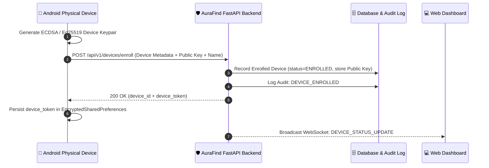
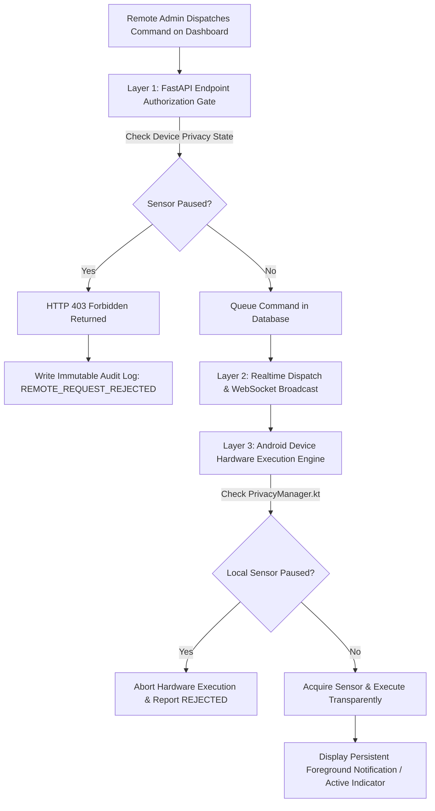

# Device-Controlled Privacy & Consent Architecture
**AuraFind Security Platform**

---

## 1. Core Security Principle

> **"The person who physically controls the enrolled Android device retains absolute, authoritative, and non-overrideable control over whether sensitive hardware sensors (Camera, Microphone, GPS Location, Loudspeaker, Remote Screen Lockdown) can be accessed remotely."**

AuraFind Security enforces a **Zero-Covert-Access** policy. No administrator, dashboard user, or backend database command can bypass, disable, or secretly override sensor privacy restrictions toggled on the physical handset.

---

## 2. Privacy Control Matrix

| Sensor / Capability | Device User Control (Android App) | Backend Enforcement | Dashboard Behavior When Paused | Immutable Audit Event |
| :--- | :--- | :--- | :--- | :--- |
| **Camera** (Live Stream & Snapshots) | Toggle in *Privacy Center* (`PAUSED_BY_DEVICE_USER`) | `POST /commands` returns `403 Forbidden`; `POST /camera/frame` drops packets | Live Stream modal blocked; `📷 CAM: PAUSED` badge displayed | `REMOTE_CAMERA_REQUEST_REJECTED` |
| **Microphone** (Two-Way VoIP & Intercom) | Toggle in *Privacy Center* (`PAUSED_BY_DEVICE_USER`) | `POST /commands` returns `403 Forbidden`; audio chunk upload rejected | Voice Call modal blocked; `🎙️ MIC: PAUSED` badge displayed | `REMOTE_MIC_REQUEST_REJECTED` |
| **GPS Location Telemetry** | Toggle in *Privacy Center* (`PAUSED_BY_DEVICE_USER`) | `POST /commands` (`LOCATE_NOW`) returns `403 Forbidden`; coordinates masked | Coordinate updates suppressed; `📍 GPS: PAUSED` badge displayed | `REMOTE_LOCATION_REQUEST_REJECTED` |
| **Loudspeaker & Siren** | Toggle in *Privacy Center* (`PAUSED_BY_DEVICE_USER`) | `POST /commands` (`PLAY_ALARM`, `SPEAK_TEXT`) returns `403 Forbidden` | Siren / TTS triggers disabled; `🔊 SPK: PAUSED` badge displayed | `REMOTE_SPEAKER_REQUEST_REJECTED` |
| **Remote Device Lockdown** | Toggle in *Privacy Center* (`RESTRICTED`) | `POST /commands` (`ENABLE_LOST_MODE`) returns `403 Forbidden` | Lost mode locked; `🔒 CTRL: LOCKED` badge displayed | `REMOTE_CONTROLS_REQUEST_REJECTED` |

---

## 3. Cryptographic Device Enrollment

Devices cannot be arbitrarily registered from the web dashboard as silent targets. Secure enrollment requires the physical APK to participate:

### Revocation Lifecycle
1. The device user or account administrator can invoke `POST /api/v1/devices/{id}/revoke`.
2. The enrollment status transitions to `REVOKED`.
3. All subsequent commands to the device are immediately blocked (`403 Forbidden`).
4. An immutable audit log entry `DEVICE_ENROLLMENT_REVOKED` is written to the cryptographic log stream.

---

## 4. Multi-Layer Privacy Gating Pipeline

To guarantee zero covert access even in the event of an adversary manipulating API packets or server configurations, consent is verified across **three independent layers**:

### Layer 1: FastAPI Server-Side Gate
When a web user or API client calls `POST /api/v1/devices/{device_id}/commands`, the backend checks the device's current privacy state:
- If `START_CAMERA_STREAM` or `CAPTURE_SNAPSHOT` is dispatched while `camera_privacy_state == "PAUSED_BY_DEVICE_USER"`, the request is immediately rejected with `403 Forbidden` (`Camera remote access is PAUSED by the device user`).
- An immutable audit log entry is saved with the requesting user ID, IP address, and rejected resource.

### Layer 2: Secure Transport & WebSocket Synchronization
- Real-time privacy state updates (`POST /api/v1/devices/{device_id}/privacy-state`) are immediately broadcast via WebSockets to all connected dashboard clients.
- Dashboard UI elements (Badges, Controls, Modals) update reactively within milliseconds.

### Layer 3: Android Local Device Defense-in-Depth
- `PrivacyManager.kt` maintains an offline-first state store in Android preferences.
- When `LocationService.kt`, `CameraStreamManager.kt`, or `VoiceCallManager.kt` receives an incoming command or begins sensor capture, it verifies the local privacy setting before hardware access.
- Even if an offline or out-of-sync backend dispatched a command, the physical Android client refuses sensor initialization and returns `CommandResultRequest(status="REJECTED")`.

---

## 5. Non-Circumvention Guarantees

1. **No Hidden Overrides**: There exists no "Admin Superuser" flag or master toggle in the backend API to override a device user's sensor pause.
2. **Offline Durability**: Privacy selections made on the handset persist across reboots, airplane mode, and network dropouts.
3. **Transparent Foreground Indicators**: Whenever the AuraFind background service is running, Android displays a mandatory persistent foreground notification. Whenever the camera or microphone is active, the Android OS hardware privacy indicators (green dot / camera icon in status bar) are clearly visible to the user holding the device.
4. **Local Audit Trail**: The Android client keeps an internal, tamper-evident rolling audit log in `SecurityPrivacyScreen.kt` showing every privacy toggle timestamp.
